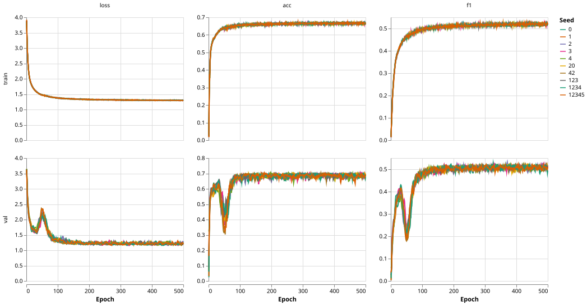
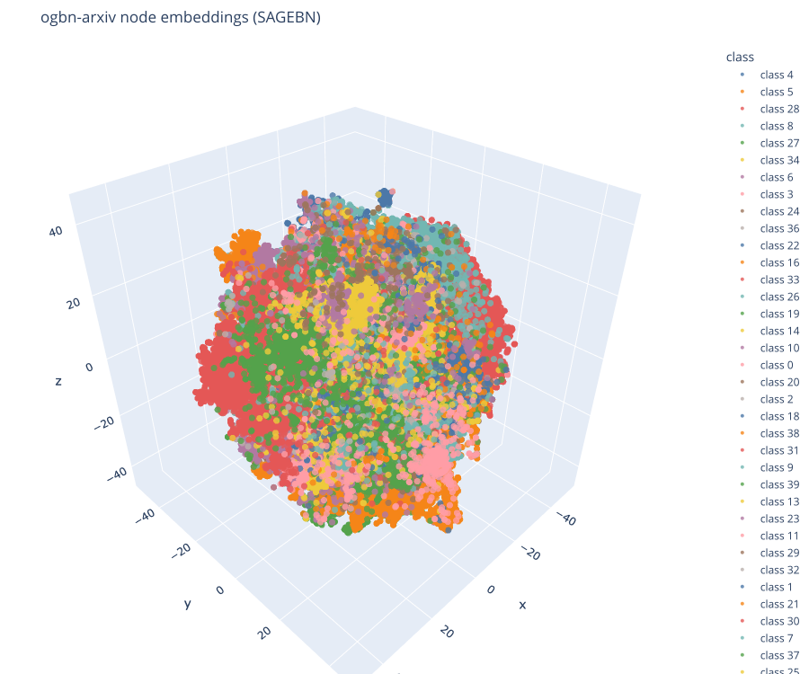
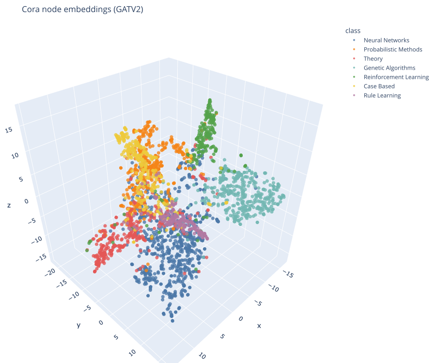
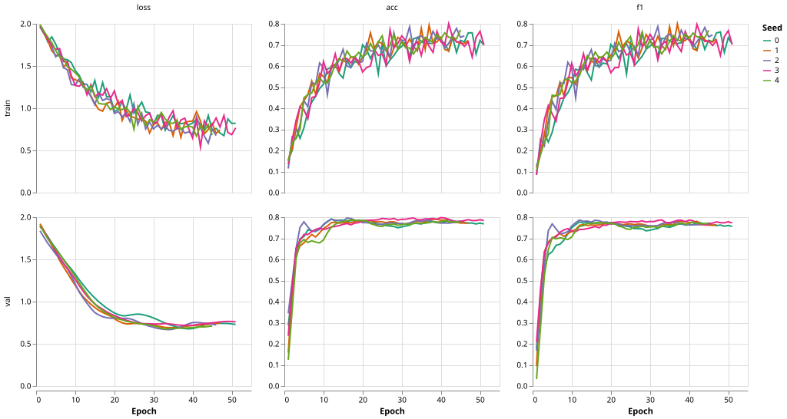

# Graph Neural Networks for Node Classification

Comparing four message-passing architectures (GCN, GraphConv, GATv2,
GraphSAGE) on citation graphs, with a protocol built to say *whether* a
difference is real rather than just which number is higher: fixed seeds,
checkpoint selection on validation loss, confidence intervals, paired
statistical tests, calibration, embedding quality and explainability.

Built on PyTorch Geometric. Starts on Cora (2.7k nodes) where every choice is
cheap to verify, then scales the same pipeline to ogbn-arxiv (169k nodes,
2.3M edges, 40 imbalanced classes).

Full methodology and results: [docs/project_report.md](docs/project_report.md).

---

## Highlights

**Cora, five seeds, 1,000 test nodes, mean with 95 % CI**

| Model | Accuracy | Macro F1 | ROC AUC | ECE ↓ |
|---|---|---|---|---|
| GCN | 0.791 [0.772, 0.810] | 0.782 | 0.952 | 0.053 |
| GraphConv | 0.778 [0.753, 0.804] | 0.771 | 0.943 | 0.118 |
| **GATv2** | **0.813 [0.801, 0.825]** | **0.802** | **0.966** | 0.046 |
| GraphSAGE | 0.803 [0.796, 0.810] | 0.795 | 0.966 | **0.044** |

- GATv2 beats GCN and GraphConv on paired test nodes (McNemar, Holm-corrected
  p = 0.012); GATv2 vs GraphSAGE is not separable. Cochran's Q across all four:
  p = 0.004.
- Sum aggregation (GraphConv) is the least calibrated model by a wide margin.
- GNNExplainer on GATv2: removing the explanation subgraph flips 40 % of
  predictions, keeping only the explanation flips none.

**ogbn-arxiv, ten seeds, mean over test split**

| Model / loss | Accuracy | Macro F1 | Balanced accuracy | ECE ↓ |
|---|---|---|---|---|
| GraphSAGE (cross entropy) | 0.653 | 0.336 | 0.331 | 0.030 |
| GATv2 (cross entropy) | 0.634 | 0.262 | 0.269 | 0.086 |
| GraphSAGE-BN (cross entropy) | 0.701 | 0.473 | 0.466 | 0.032 |
| **GraphSAGE-BN (cross entropy, Optuna-tuned)** | **0.718** | **0.512** | 0.496 | 0.039 |
| GraphSAGE-BN (weighted CE, tempered, Optuna-tuned) | 0.684 | 0.502 | **0.536** | **0.021** |

- Balanced accuracy, not accuracy, is what matters here: 40 classes with a
  775× imbalance between the largest and smallest. GraphSAGE-BN's 0.701
  accuracy comes with only 0.466 balanced accuracy, barely ahead of
  Node2vec (0.701 accuracy on the OGB leaderboard, a shallow embedding
  method with no message passing).
- Optuna tuning helps the cross-entropy model (+1.6 accuracy / +3.0
  balanced-accuracy points); tempering the weighted-CE loss
  (`weight_power=0.5`) trades 3.4 accuracy points for 4.0 balanced-accuracy
  points and better calibration versus the tuned CE model, a genuine
  accuracy/fairness trade-off rather than a strict win.
- The citation graph must be symmetrised or 64 % of test nodes receive no
  messages (accuracy stalls at 0.40); without BatchNorm, weight decay is
  what keeps lr 0.01 stable.




<!-- TODO figures: copy from outputs/figures once final


-->

---

## What is in the box

| Piece | Where |
|---|---|
| Four models sharing one layer recipe, plus a BatchNorm GraphSAGE | `src/node_classification/node_models.py` |
| Cora training, Planetoid split | `src/node_classification/planetoid_node_classification.py` |
| OGB training: full batch or NeighborLoader, layer-wise inference, three losses, LR scheduling, flag validation | `src/node_classification/ogb_run.py` |
| Best-model selection, training curves, 3D embeddings, silhouette | `visualise_best.py`, `best_model.py` |
| Cochran's Q, McNemar, Friedman, Kruskal-Wallis, Wilcoxon with Holm | `compare_best.py`, `src/common/statistical_tests.py` |
| GNNExplainer with fidelity, unfaithfulness, characterisation | `explain_best.py`, `src/common/explainability.py` |
| Optuna search (TPE + pruning), CLI or notebook, resumable | `src/node_classification/optuna_search.py` |
| Metrics incl. Brier, ECE, ROC AUC, silhouette | `src/common/evaluation_metrics.py` |
| Graph EDA and plotting helpers (Altair, Plotly) | `src/common/graph_eda.py`, `altair_plots.py`, `plotly_plots.py` |
| Notebooks: Cora EDA, Cora GCN walkthrough, arxiv EDA, custom circuit data | `notebooks/` |
| Tests for the model recipe, loaders, statistics and the search | `test/` |

---

## Method in one paragraph

Every model applies `dropout → conv → activation` per layer and a linear
head; `encode` exposes the pre-head embeddings. Each seed fixes
initialisation, trains with early stopping, and reloads the checkpoint from
the epoch of lowest validation loss before touching the test set once.
Summaries report the mean over seeds with a t confidence interval. Models
are then compared at the node level (paired correctness of the best-seed
checkpoints) and at the seed level (one score per seed), with Holm
correction on the pairwise tests. Hyperparameters are searched on one seed
and confirmed on the full seed list; the tuned seed's score is never
reported.

---

## Quick start

```bash
uv sync                                   # macOS arm64 lockfile (pyg-lib wheel)

# Cora: train all four models, build the tables, compare, visualise, explain
bash scripts/train_cora_all.sh
uv run python scripts/cora_results_md.py
uv run python src/node_classification/compare_best.py --dataset Cora
uv run python src/node_classification/visualise_best.py --dataset Cora --metric f1
uv run python src/node_classification/explain_best.py --dataset Cora --metric f1

# ogbn-arxiv, ten seeds, full batch (the finished grid's SAGE cross-entropy tag)
uv run python -m src.node_classification.ogb_run --model SAGE --loss cross_entropy \
    --num_layers 3 --lr 0.01 --hidden_channels 256 --dropout 0.5 --weight_decay 0 \
    --no-dataloader --no-scheduler --epochs 500 --early_stop 501

uv run python src/node_classification/compare_best.py --dataset ogbn-arxiv \
    --tags sage_cross_entropy sagebn_cross_entropy gatv2_cross_entropy --label architectures
uv run python src/node_classification/visualise_best.py --dataset ogbn-arxiv \
    --model SAGEBN --loss weighted_ce_p0.5

# Hyperparameter search
uv run python -m src.node_classification.optuna_search --dataset ogbn-arxiv --model SAGE --n_trials 30

# Tests
uv run --with pytest python -m pytest test/
```

Python 3.12, PyTorch 2.13, PyG 2.8. Trained on Apple silicon (MPS); CUDA is
picked up automatically.

---

## Layout

`src/` (models, training, comparison, search), `notebooks/`, `scripts/`,
`docs/` (report and results), `test/`. `outputs/` (checkpoints, metrics,
figures) is git-ignored. See `docs/project_report.md` for what each piece
does and how the results were produced.

## Roadmap

Node classification (Cora and ogbn-arxiv) is finished, including the Optuna
search and GNNExplainer-based explainability metrics on Cora. What's left is
optional infrastructure and unstarted extensions:

- ogbn-products, as a stepping stone if a bigger dataset is needed later,
  not an active task. The NeighborLoader/layer-wise inference path is
  already tested and working (arxiv pilots with it scored higher than
  full-batch SAGEBN, though those models were also larger, so that isn't
  yet a clean ablation of batching alone versus model capacity). The actual
  new work would be the dataset processing itself: ogbn-products isn't
  already downloaded and prepared the way arxiv is, and at ~2.4M nodes /
  61M edges it's a different scale than anything `load_ogb_node` has
  handled so far.
- Graph classification and link prediction on the custom circuit dataset.

---

## Acknowledgments

## Acknowledgments

**Project ownership.** The research questions, experimental design, model comparisons, evaluation strategy, statistical methodology, interpretation of results, and final engineering decisions are the author's work. AI tools were not used to originate the project or determine its research objectives.

**AI-assisted development.** AI coding assistants were used during implementation to accelerate code development, debugging, refactoring, documentation, and review. Suggestions were discussed and evaluated iteratively: proposed changes were examined for their purpose and impact, tested against the project, and accepted, modified, or rejected by the author.

**Tools and responsibility.** Claude (Anthropic) and Codex (OpenAI), integrated into the development environment, were used to generate and cross-check implementation suggestions. AI-generated output was not treated as an authoritative source of results or methodology. The author remains responsible for the code, experimental design, statistical analysis, interpretation, and conclusions presented in this repository.

AI assistance also supported testing and debugging of the reusable pipeline. The aim was not only to accelerate development, but to make the implementation sufficiently robust to apply the same model, training, selection, evaluation, and comparison framework to additional datasets.